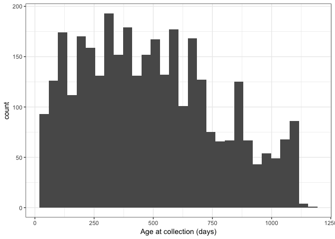

# 2. Sample preprocessing example

Example script in deata preprocessing; prepare a subset of microbiome samples for downstream analysis without generating additional files. The data used in this example is publicly available at https://pubs.broadinstitute.org/diabimmune/combined-data/

You can hide irrelevant code blocks, such as loading libraries, by adding "include=FALSE" in header


```r
sample_metadata <- read.xlsx("data/diabimmune_combined_metadata.xlsx", sheet = 2)
head(sample_metadata)
```

```
##   subjectID country sampleID age_at_collection cohort gid_wgs gid_16s
## 1   E000823     FIN  3000150                56    abx    <NA>  G74397
## 2   E000823     FIN  3102720               259    abx    <NA>  G69867
## 3   E000823     FIN  3114328               760    abx    <NA>  G74423
## 4   E000823     FIN  3106240               511    abx    <NA>  G74306
## 5   E000823     FIN  3000042               151    abx    <NA>  G69730
## 6   E000823     FIN  3108596              1064    abx  G80124  G74454
```

This data contains microbiome samples from young children during first three years of life. Now let's say we wanted to do an analysis with only a subset of samples; samples during the first year of life. Second filter command below will only include samples where metagenomic data is available (i.e. sampleID is not `<NA>)


```r
ggplot(sample_metadata, aes(x=age_at_collection)) + 
  geom_histogram() + 
  xlab("Age at collection (days)") +
  theme_bw()
```

```
## `stat_bin()` using `bins = 30`. Pick better value with `binwidth`.
```

<!-- -->

```r
metadata_first_year_metagenomes <-
  sample_metadata %>%
  filter(age_at_collection < 365) %>%
  filter(!(is.na(gid_wgs)))
head(metadata_first_year_metagenomes)
```

```
##   subjectID country sampleID age_at_collection  cohort gid_wgs gid_16s
## 1   E001463     FIN  3101140               303     t1d  G45078  G36451
## 2   E001958     FIN  3000110                61     abx  G79041  G69741
## 3   E001958     FIN  3101279               358     abx  G78966  G68204
## 4   E002338     FIN  3000144                58 karelia  G80490  G75872
## 5   E002338     FIN  3101046               122 karelia  G80538    <NA>
## 6   E002338     FIN  3101193               304 karelia  G80541  G75694
```

```r
nrow(metadata_first_year_metagenomes)
```

```
## [1] 427
```

Now, proceed with reading the microbiome profiles from the "master" file and check that all samples are included...


```r
metaphlan_data <- read_metaphlan_table("data/diabimmune_metaphlan_table.txt")
all(metadata_first_year_metagenomes$gid_wgs %in% rownames(metaphlan_data))
```

```
## [1] TRUE
```
.. and then filter down to the desired samples.

```r
metaphlan_data_first_year <-
  metaphlan_data[ metadata_first_year_metagenomes$gid_wgs , ]
nrow(metaphlan_data_first_year)
```

```
## [1] 427
```
Now we are ready to conduct any analysis using this subset of samples without generating any additional files. The filtering process down to this point is highly reprducible and explained in this document.
