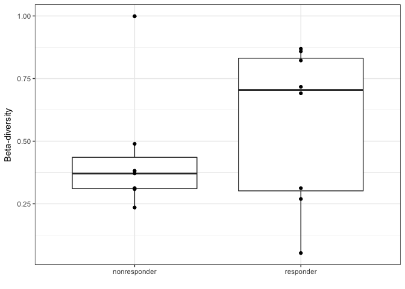
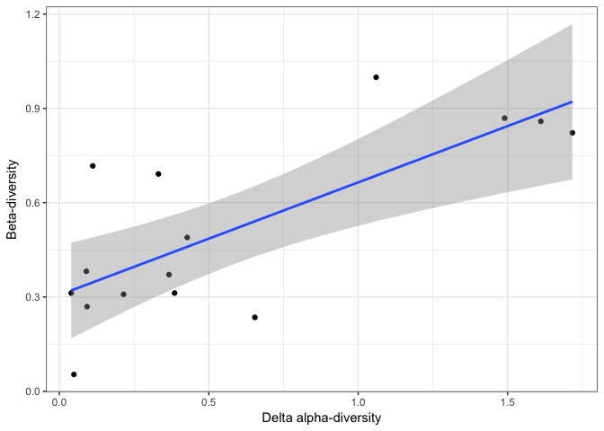

# 3. Paired sample analysis example


The data in this example was generated in fecal microbial transplantation (FMT) study in Crohn's Disease patients. Patients were further divided into responders and non-responders, and their microbiome was characterized by metagenomic sequencing at baseline (before FMT) and at three time points afterwards. The results and data were published in the reference below:

> BP Vaughn, T Vatanen, JR Allegretti, A Bai, RJ Xavier, J Korzenik, D Gevers, A Ting, SC Robson, AC Moss. Increased Intestinal Microbial Diversity following Fecal Microbiota Transplant for Active Crohn's Disease. Inflammatory Bowel Diseases, 22 (9), 2016.

Load and inspect data from Crohn's Disease FMT study


```r
load("data/BIDMC-metadata.RData")
ls()
```

```
## [1] "map_bidmc"
```

```r
head(map_bidmc)
```

```
##   Project PF.Reads diversity1 time donor subject donor_row before_after
## 1  G85432 55819642  2.9381309    1 D9002   R1004        53       before
## 2  G85433 51918680  0.4359094    3 D9002   R1002        53        after
## 3  G85434 42663690  2.3467628    1 D9002   R1006        53       before
## 4  G85435 50075412  2.4598608    1 D9001   R1007        12       before
## 5  G85436 64771644  2.8985755    2 D9002   R1004        53        after
## 6  G85437 58548192  2.7587309    3 D9001   R1001        12        after
##   donor_recipient response_bin response_fact
## 1       recipient    responder     sustainer
## 2       recipient nonresponder  nonresponder
## 3       recipient    responder  nonsustainer
## 4       recipient nonresponder  nonresponder
## 5       recipient    responder     sustainer
## 6       recipient    responder     sustainer
```

```r
dim(map_bidmc)
```

```
## [1] 53 11
```

```r
map_bidmc_simple <-
  map_bidmc %>%
  rename(sampleID = Project) %>%
  filter(donor_recipient == "recipient",
         time %in% c(1,2)) %>%
  select(sampleID, time, subject, response_bin, diversity1) 
head(map_bidmc_simple)
```

```
##   sampleID time subject response_bin diversity1
## 1   G85432    1   R1004    responder   2.938131
## 2   G85434    1   R1006    responder   2.346763
## 3   G85435    1   R1007 nonresponder   2.459861
## 4   G85436    2   R1004    responder   2.898575
## 5   G85438    1   R1005 nonresponder   1.788067
## 6   G85440    2   R1002 nonresponder   1.989687
```

```r
metaphlan_data <- read_metaphlan_table("data/BIDMC-FMT_metaphlan.txt")
dim(metaphlan_data)
```

```
## [1]  59 264
```

```r
rownames(metaphlan_data) %in% map_bidmc_simple$sampleID
```

```
##  [1]  TRUE FALSE  TRUE  TRUE  TRUE FALSE  TRUE FALSE  TRUE  TRUE  TRUE
## [12]  TRUE FALSE  TRUE FALSE FALSE  TRUE FALSE  TRUE  TRUE FALSE FALSE
## [23] FALSE  TRUE FALSE FALSE  TRUE  TRUE  TRUE FALSE  TRUE  TRUE FALSE
## [34]  TRUE  TRUE FALSE FALSE FALSE FALSE  TRUE FALSE  TRUE  TRUE  TRUE
## [45]  TRUE FALSE  TRUE FALSE  TRUE FALSE  TRUE FALSE  TRUE  TRUE FALSE
## [56]  TRUE  TRUE FALSE FALSE
```
Remove MetaPhlAn profiles that are not included in the metadata table:

```r
metaphlan_data_filtered <- metaphlan_data[ rownames(metaphlan_data) %in% map_bidmc_simple$sampleID , ]
```
Compute beta diversities:

```r
beta_diversities <- vegdist(metaphlan_data, 
                            method = "bray")
dim(beta_diversities)
```

```
## [1] 59 59
```

```r
as.matrix(beta_diversities)[1:5,1:5]
```

```
##           G85432 G85433    G85434    G85435    G85436
## G85432 0.0000000      1 0.8634328 0.7298783 0.3124598
## G85433 1.0000000      0 1.0000000 1.0000000 1.0000000
## G85434 0.8634328      1 0.0000000 0.6390124 0.8515548
## G85435 0.7298783      1 0.6390124 0.0000000 0.6666648
## G85436 0.3124598      1 0.8515548 0.6666648 0.0000000
```
Now we process the beta-diversity matrix to select the desired beta-diversities; only within-subject comparisons of baseline vs. time point 2:

```r
beta_diversities_long <- 
  as.matrix(beta_diversities) %>%
  as.data.frame() %>%
  rownames_to_column("Sample1") %>%
  gather(Sample2, beta_div, -Sample1) %>%
  mutate(ID = apply(cbind(as.character(Sample1), as.character(Sample2)), 1, function(x) {str_c(sort(x), collapse = ":")})) %>%
  distinct(ID, .keep_all = T) %>%
  filter(!(Sample1 == Sample2))
```
The process line by line:

* Transforn dist-object to numerical matrix
* Transform numberical matrix to data frame (required for downstream processing)
* Move row names to column (Sample1)
* Transform to long format (gather) while keeping column `Sample1`
* Create a new column `ID` to remove duplicate entries where the sample order is reversed. `ID` has the sample IDs in alphanumeric order and allows removing duplicate entries
* Remove rows where `ID` is duplicated (while keeping other columns)

Next we combine with subject metadata (subject ID), and remove comparisons accross subjects

```r
beta_diversities_per_subject <- 
  beta_diversities_long %>%
  right_join(map_bidmc_simple %>%
              rename(Sample1 = sampleID,
                     time_sample1 = time,
                     subject_sample1 = subject,
                     diversity_sample1 = diversity1)) %>%
  right_join(map_bidmc_simple %>%
              rename(Sample2 = sampleID,
                     time_sample2 = time,
                     subject_sample2 = subject,
                     diversity_sample2 = diversity1)) %>%
  filter(subject_sample1 == subject_sample2)
```

```
## Joining, by = "Sample1"
```

```
## Joining, by = c("Sample2", "response_bin")
```
We need to combine with metadata twice to include annotations for both samples on each row.

Let's first compare beta diversities between responders and non-responders

```r
ggplot(beta_diversities_per_subject, aes(y=beta_div, x=response_bin)) +
         geom_boxplot() +
         geom_point() +
         theme_bw() +
         xlab("") +
         ylab("Beta-diversity")
```

<!-- -->

```r
t.test(beta_div ~ response_bin, data=beta_diversities_per_subject)
```

```
## 
## 	Welch Two Sample t-test
## 
## data:  beta_div by response_bin
## t = -0.8898, df = 12.957, p-value = 0.3898
## alternative hypothesis: true difference in means is not equal to 0
## 95 percent confidence interval:
##  -0.4516558  0.1882038
## sample estimates:
## mean in group nonresponder    mean in group responder 
##                  0.4424682                  0.5741942
```
The difference looks large but is not statistically significant.

Let's then compare beta-diversities to the absolute shift (delta) in alpha-diversity

```r
beta_diversities_per_subject_delta_alpha <- 
  beta_diversities_per_subject %>%
  mutate(delta_alpha_diversity = abs(diversity_sample2 - diversity_sample1))

ggplot(beta_diversities_per_subject_delta_alpha, aes(x=delta_alpha_diversity, beta_div)) + 
  geom_point() + 
  geom_smooth(method = "lm") +
  theme_bw() +
  xlab("Delta alpha-diversity") +
  ylab("Beta-diversity")
```

<!-- -->

```r
cor.test(beta_diversities_per_subject_delta_alpha$delta_alpha_diversity,
         beta_diversities_per_subject_delta_alpha$beta_div)
```

```
## 
## 	Pearson's product-moment correlation
## 
## data:  beta_diversities_per_subject_delta_alpha$delta_alpha_diversity and beta_diversities_per_subject_delta_alpha$beta_div
## t = 4.0047, df = 13, p-value = 0.001499
## alternative hypothesis: true correlation is not equal to 0
## 95 percent confidence interval:
##  0.3728569 0.9092750
## sample estimates:
##       cor 
## 0.7431731
```
Positive correlation is statistically significant. Is this really surprising though? If there is a large shift in alpha-diversity, you'd expect large beta-diversity as well (i.e. these two measures are connected). 
